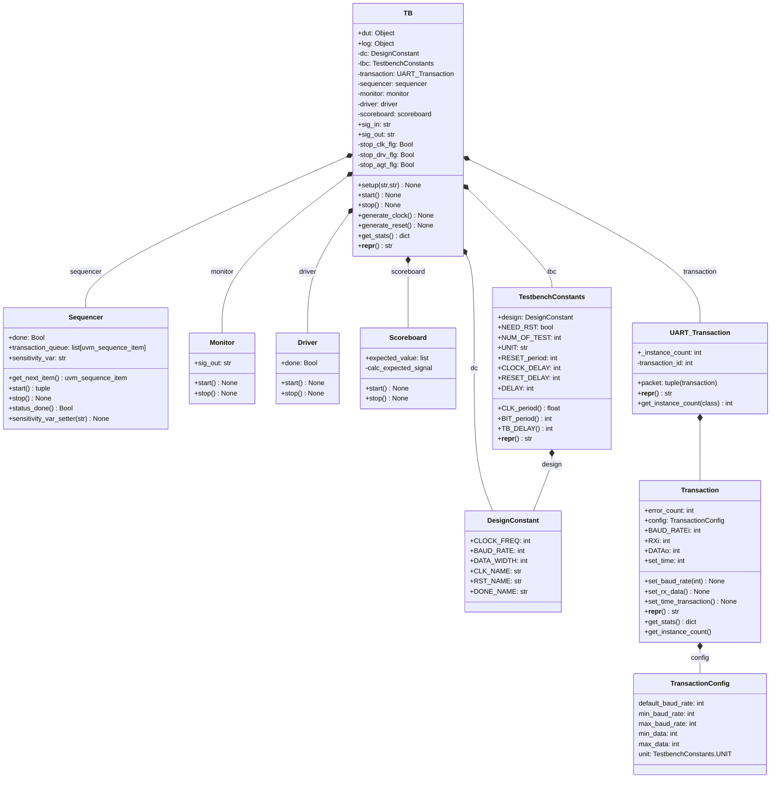

# UML Class diagram for UART cocotb testbench

## Mermaid code

The following is a cocotb UML class diagram of the test:

```mermaid
    classDiagram
    class TB {
        +dut: Object
        +log: Object
        -dc: DesignConstant
        -tbc: TestbenchConstants
        -transaction: UART_Transaction
        -sequencer: sequencer
        -monitor: monitor
        -driver: driver
        -scoreboard: scoreboard
        +sig_in: str
        +sig_out: str
        -stop_clk_flg: Bool
        -stop_drv_flg: Bool
        -stop_agt_flg: Bool
        +setup(str,str) None
        +start() None
        +stop() None
        +generate_clock() None
        +generate_reset() None
        +get_stats() dict
        +__repr__() str
    }

    class Sequencer {
        +done: Bool
        +transaction_queue: list[uvm_sequence_item]
        +sensitivity_var: str
        +get_next_item() uvm_sequence_item
        +start() tuple
        +stop() None
        +status_done() Bool
        +sensitivity_var_setter(str) None
    }

    class Monitor {
        +sig_out: str
        +start() None
        +stop() None
    }

    class Driver {
        +done: Bool
        +start() None
        +stop() None
    }

    class Scoreboard {
        +expected_value: list
        +start() None
        +stop() None
        -calc_expected_signal
    }

    TB *-- DesignConstant : dc
    TB *-- TestbenchConstants : tbc
    TB *-- UART_Transaction : transaction
    TB *-- Sequencer : sequencer
    TB *-- Monitor : monitor
    TB *-- Driver : driver
    TB *-- Scoreboard : scoreboard

    class DesignConstant {
        +CLOCK_FREQ: int
        +BAUD_RATE: int
        +DATA_WIDTH: int
        +CLK_NAME: str
        +RST_NAME: str
        +DONE_NAME: str
    }

    class TestbenchConstants {
        +design: DesignConstant
        +NEED_RST: bool
        +NUM_OF_TEST: int
        +UNIT: str 
        +RESET_period: int
        +CLOCK_DELAY: int
        +RESET_DELAY: int
        +DELAY: int
        +CLK_period() float
        +BIT_period() int
        +TB_DELAY() int
        +__repr__() str
    }

    class TransactionConfig {
        default_baud_rate: int
        min_baud_rate: int
        max_baud_rate: int
        min_data: int
        max_data: int
        unit: TestbenchConstants.UNIT
    }
    class Transaction {
        +error_count: int
        +config: TransactionConfig
        +BAUD_RATEi: int
        +RXi: int
        +DATAo: int
        +set_time: int
        +set_baud_rate(int) None
        +set_rx_data() None
        +set_time_transaction() None
        +__repr__() str
        +get_stats() dict
        +get_instance_count()
    }
    class UART_Transaction {
        +_instance_count: int
        +packet: tuple(transaction)
        -transaction_id: int
        +__repr__() str
        +get_instance_count(class) int
    }


    TestbenchConstants *-- DesignConstant : design
    UART_Transaction *-- Transaction
    Transaction *-- TransactionConfig : config

```

