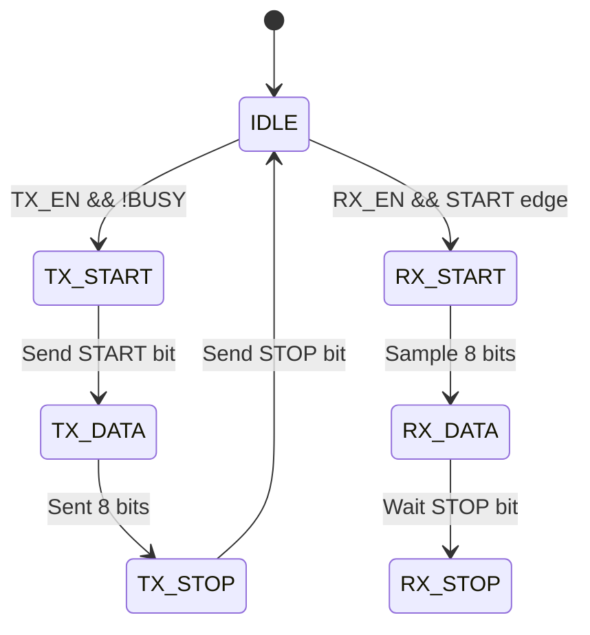

### **Архитектурная спецификация UART (Universal Asynchronous Receiver-Transmitter)**  
**Версия:** 1.0  
**Дата:** 26.07.25
**Автор:** ImpulsePower  

---

## **1. Обзор**  
UART — это последовательный интерфейс для асинхронной передачи данных между устройствами.  
**Основные характеристики:**  
- Скорость передачи: **9600 — 115200 бод** (настраивается).  
- Формат данных: **8 бит**, 1 стоп-бит, без контроля чётности (по умолчанию).  
- Поддержка **прерываний** (TX Complete, RX Ready).  

---

## **2. Блок-схема**  
```plaintext
                    +---------------+
                    |               |
          TX_DATA -->|    UART       |--> RX_DATA
                    |   Controller  |
          CLK    -->|               |<-- RESET_N
                    +---------------+
                          |     |
                      TX_PIN  RX_PIN
```

---

## **3. Регистры**  
| Адрес | Название     | Описание                          | Доступ |  
|-------|--------------|-----------------------------------|--------|  
| 0x00  | `UART_DR`    | Data Register (TX/RX)             | R/W    |  
| 0x04  | `UART_CR`    | Control Register (Baud Rate, IRQ) | R/W    |  
| 0x08  | `UART_SR`    | Status Register (Busy, Error)     | RO     |  

---

## **4. Форматы данных**  
### **4.1. Кадр UART**  
```plaintext
START | D0 | D1 | D2 | D3 | D4 | D5 | D6 | D7 | STOP
  0   |  1 | 0  | 1 | 0  | 1  | 0  | 1  | 0  |   1
```

### **4.2. Control Register (`UART_CR`)**  
| Бит  | Название    | Описание                          |  
|------|-------------|-----------------------------------|  
| 7:4  | `BAUD_DIV`  | Делитель частоты (Baud Rate = CLK / (16 * BAUD_DIV)) |  
| 3    | `TX_EN`     | Разрешение передачи (1 = включено) |  
| 2    | `RX_EN`     | Разрешение приёма (1 = включено)   |  
| 1    | `TX_IRQ_EN` | Прерывание по завершению передачи  |  
| 0    | `RX_IRQ_EN` | Прерывание по приёму данных        |  

---

## **5. Временные параметры**  
| Параметр             | Значение       | Условия               |  
|-----------------------|----------------|-----------------------|  
| Минимальная длительность START-бита | 1 такт | При `BAUD_DIV = 1` |  
| Задержка между кадрами | ≥ 2 стоп-бита | Для коррекции меток времени |  

---

## **6. Состояния (FSM)**  


---

## **7. Интерфейсы**  
### **7.1. Сигналы**  
| Сигнал    | Направление | Описание                |  
|-----------|-------------|-------------------------|  
| `CLK`     | input       | Тактовая частота (50 MHz) |  
| `RESET_N` | input       | Асинхронный сброс (0 — активен) |  
| `TX_PIN`  | output      | Выход передатчика       |  
| `RX_PIN`  | input       | Вход приемника          |  

### **7.2. AXI-Lite (опционально)**  
Если UART интегрирован в SoC:  
```verilog
module uart_axi_lite (
    input  wire        ACLK,
    input  wire        ARESETN,
    input  wire [31:0] AWADDR,
    input  wire        AWVALID,
    output wire        AWREADY,
    // ... другие AXI-сигналы ...
);
```

---

## **8. Ошибки и обработка**  
| Ошибка                | Действие                          |  
|-----------------------|-----------------------------------|  
| **Framing Error**     | `UART_SR[1] = 1`, сброс RX-буфера |  
| **Overrun Error**     | `UART_SR[2] = 1`, прерывание      |  

---

## **9. Тестовые сценарии**  
1. **Передача байта `0x55`**:  
   - Установить `UART_CR[7:4] = 6` (9600 бод при CLK=50 MHz).  
   - Записать `0x55` в `UART_DR`.  
   - Проверить длительность импульсов на `TX_PIN`.  

2. **Приём с ошибкой**:  
   - Искусственно укоротить STOP-бит на `RX_PIN`.  
   - Убедиться, что `UART_SR[1] = 1`.  

---

## **10. Приложения**  
1. **Ссылки на стандарты**: [UART RS-232](https://ru.wikipedia.org/wiki/RS-232).  
2. **Пример кода**: В папке `rtl/uart/`.  

---
