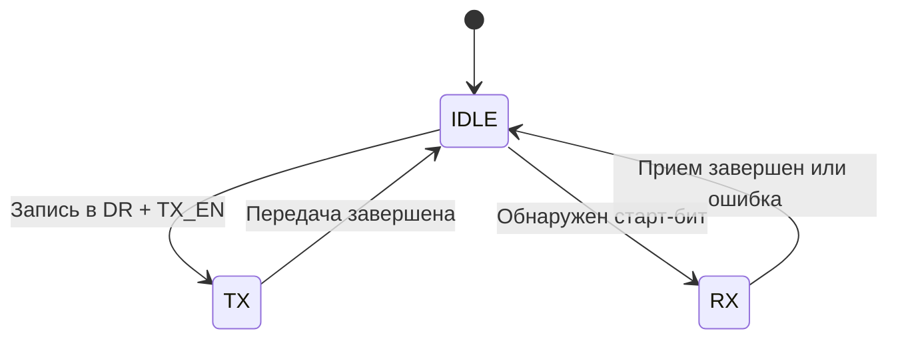

### **Функциональная спецификация UART (Universal Asynchronous Receiver-Transmitter)**  
**Версия:** 1.0  
**Дата:** 26.07.25
**Автор:** ImpulsePower  

---

## **1. Назначение**  
UART предназначен для асинхронной последовательной передачи данных между устройствами.  
**Ключевые функции:**  
- Передача и прием данных на скоростях **9600–115200 бод** (программируемых).  
- Поддержка форматов данных: **5–9 бит**, 1–2 стоп-бита, контроль чётности (опционально).  
- Генерация прерываний по событиям (окончание передачи/приема, ошибки).  

---

## **2. Интерфейсы**  
### **2.1. Аппаратные сигналы**  
| Сигнал       | Тип      | Описание                          |  
|--------------|----------|-----------------------------------|  
| `CLK`        | Вход     | Тактовая частота (100 МГц)         |  
| `RESET_N`    | Вход     | Асинхронный сброс (активный 0)    |  
| `TX_DATA`    | Выход    | Последовательные данные (передача)|  
| `RX_DATA`    | Вход     | Последовательные данные (прием)   |  
| `IRQ`        | Выход    | Прерывание (опционально)          |  

### **2.2. Программный интерфейс (регистры)**  
| Адрес  | Регистр   | Назначение                         | Поля (биты)                     |  
|--------|-----------|------------------------------------|----------------------------------|  
| 0x00   | `DR`      | Data Register                      | `DATA[7:0]` — передаваемые/принимаемые данные |  
| 0x04   | `CR`      | Control Register                   | `BAUD[15:0]` — делитель частоты<br>`PARITY_EN` — контроль чётности<br>`TX_EN`/`RX_EN` — разрешение передачи/приема |  
| 0x08   | `SR`      | Status Register                    | `TX_BUSY` — передача в процессе<br>`RX_READY` — данные приняты<br>`FRAME_ERR` — ошибка стоп-бита |  

---

## **3. Функциональные требования**  
### **3.1. Передача данных**  
1. При записи в `DR` и установленном `TX_EN` начинается передача кадра:  
   - **Старт-бит (0)** → **Данные (5–9 бит)** → **Стоп-бит (1)**.  
2. Скорость передачи:  
   \[
   \text{Baud Rate} = \frac{\text{CLK}}{\text{16} \times \text{BAUD}}
   \]  
   Пример: Для `CLK=50 МГц` и `BAUD=325` → **9600 бод**.  

### **3.2. Прием данных**  
1. Приемник обнаруживает старт-бит (падение `RX_DATA` с 1 на 0).  
2. Данные сэмплируются в **середине битового интервала**.  

### **3.3. Обработка ошибок**  
| Ошибка               | Условие                          | Реакция                     |  
|-----------------------|----------------------------------|-----------------------------|  
| **Framing Error**     | Неверный стоп-бит (0)           | `SR[FRAME_ERR]=1`, сброс буфера |  
| **Overrun Error**     | Новые данные до чтения `DR`     | `SR[OVERRUN_ERR]=1`         |  

---

## **4. Диаграммы**  
### **4.1. Временная диаграмма передачи**  
```plaintext
TX_DATA:    ___    0    1   0   1   0   1   0   1    ___  
            | |    |    |   |   |   |   |   |   |   | |  
CLK:      ↑_↓_↑_↓_↑_↓_↑_↓_↑_↓_↑_↓_↑_↓_↑_↓_↑_↓_↑_↓_↑_↓_↑  
           Start   D0  D1  D2  D3  D4  D5  D6  D7  Stop  
```

### **4.2. Состояния (FSM)**  


---

## **5. Тестовые сценарии**  
### **5.1. Корректная передача**  
1. Установить `CR[BAUD]=325`, `CR[TX_EN]=1`.  
2. Записать `0x55` в `DR`.  
3. Проверить длительность битов на `TX_DATA` (104 мкс для 9600 бод).  

### **5.2. Ошибка формата**  
1. Подать на `RX_DATA` кадр с нулевым стоп-битом.  
2. Убедиться, что `SR[FRAME_ERR]=1`.  

---

## **6. Ограничения**  
- **Максимальная скорость**: 1/16 от `CLK` (для 50 МГц — 3.125 Мбод).  
- **Тактовая синхронизация**: Нет встроенного PLL, требуется стабильный `CLK`.  

---

## **7. Приложения**  
1. **Пример кода**:  
   ```verilog
   always @(posedge CLK) begin
       if (TX_EN && !BUSY) begin
           TX_DATA <= 0; // Старт-бит
           // ... передача данных ...
       end
   end
   ```  
2. **Ссылки**: [Стандарт RS-232](https://ru.wikipedia.org/wiki/RS-232).  

---
